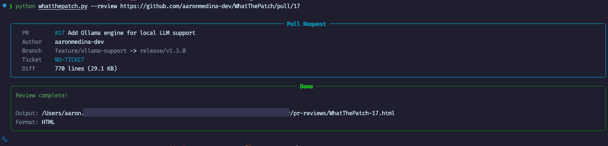
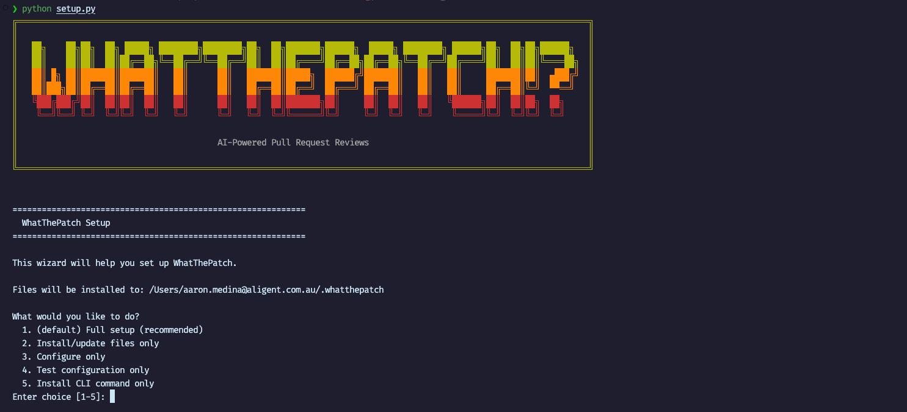
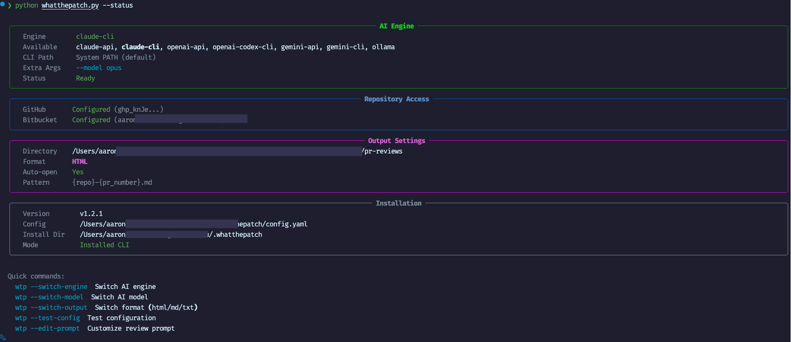
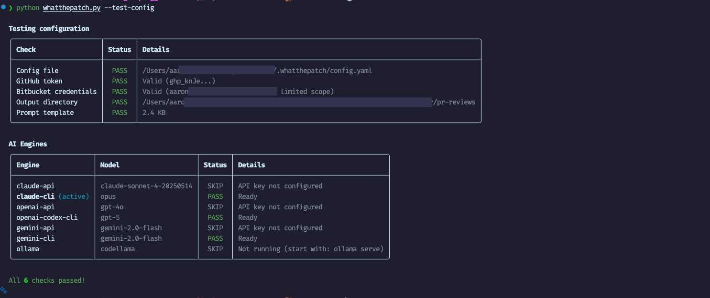
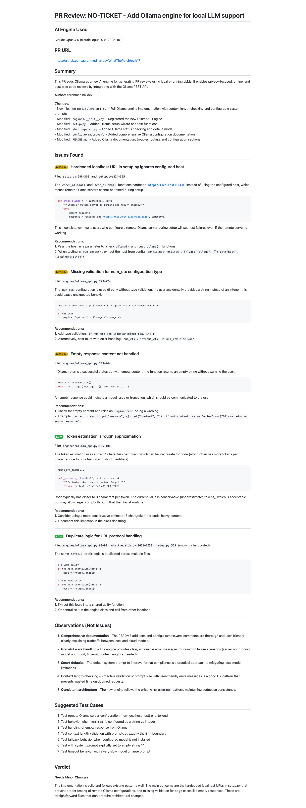

[](LICENSE)
[](https://www.python.org/downloads/)
[](https://github.com/aaronmedina-dev/WhatThePatch/commits/main)
[](https://github.com/aaronmedina-dev/WhatThePatch/issues)
[]()

# WhatThePatch!?

A CLI tool to automatically generate PR reviews using AI. Supports GitHub and Bitbucket pull requests.

## Table of Contents

- [Why This Tool?](#why-this-tool)
- [Quick Start](#quick-start)
- [Supported Engines](#supported-engines)
- [Usage](#usage)
- [External Context](#external-context)
- [Customizing Reviews](#customizing-reviews)
- [Documentation](#documentation)
- [Development](#development)

## Why This Tool?

With AI-assisted coding, changes are being pushed at unprecedented speed. WhatThePatch helps developers digest and understand changes in their codebase by providing comprehensive, intelligent code reviews.

**Note:** This tool isn't claiming to be "better" than SaaS solutions like CodeRabbit or PR-Agent - those are excellent tools with great features like inline PR comments and team integrations. WhatThePatch fills a different niche: developers and DevOps engineers who work across **multiple clients, organizations, or platforms** where installing a third-party integration on every repository isn't practical or allowed.

**Where WhatThePatch shines:**

| Scenario | WhatThePatch | SaaS Tools |
|----------|--------------|------------|
| Multiple client repositories | Works anywhere with a PR URL | Needs integration per repo |
| Mixed GitHub + Bitbucket | Single tool for both | Often platform-specific |
| Private/external context | Include any files as context | Limited to connected repos |
| Air-gapped environments | Ollama runs fully offline | Requires internet |
| Custom review criteria | Fully editable prompts | Fixed or limited |
| One-off reviews | No setup required | Subscription needed |

<details>
<summary><strong>WTP in Action</strong> (click to expand)</summary>

<br>

### Running a Review



### Setup Wizard



### Status Check



### Configuration Test



### HTML Report Output



</details>


## Quick Start

### 1. Run the setup wizard

```bash
python setup.py
```

This will:
- Install required dependencies
- Guide you through configuration
- Test your setup
- Install the `wtp` CLI command

### 2. Generate a review

```bash
wtp --review https://github.com/owner/repo/pull/123
```

That's it. The review opens automatically in your browser.

### Requirements

- Python 3.9+
- One AI provider (see [Supported Engines](#supported-engines))
- GitHub token and/or Bitbucket credentials (for accessing PRs)

## Supported Engines

Choose the AI engine that fits your needs:

| Engine | Type | Best For |
|--------|------|----------|
| `claude-api` | API | Direct Anthropic API access |
| `claude-cli` | CLI | Team users with Claude Code |
| `openai-api` | API | Direct OpenAI API access |
| `openai-codex-cli` | CLI | ChatGPT Plus/Pro subscribers |
| `gemini-api` | API | Direct Google AI API access |
| `gemini-cli` | CLI | Google Cloud users |
| `ollama` | Local | Privacy, offline, no API costs |

Switch engines anytime with `wtp --switch-engine`.

For detailed configuration of each engine, see [docs/engines.md](docs/engines.md).

## Usage

### Basic Commands

```bash
# Generate a review
wtp --review <PR_URL>

# Add external context
wtp --review <PR_URL> --context /path/to/related/code

# Different output format
wtp --review <PR_URL> --format md

# Test without calling AI
wtp --review <PR_URL> --dry-run
```

### All Commands

| Command | Description |
|---------|-------------|
| `wtp --review <URL>` | Generate a review for the given PR |
| `wtp --review <URL> -c <PATH>` | Add file/directory/URL as context (repeatable) |
| `wtp --review <URL> --dry-run` | Show what would be sent without calling AI |
| `wtp --review <URL> --format <fmt>` | Override output format (html, md, txt) |
| `wtp --status` | Show current configuration |
| `wtp --switch-engine` | Switch between AI engines |
| `wtp --switch-model` | Switch AI model for active engine |
| `wtp --switch-output` | Switch default output format |
| `wtp --test-config` | Test your configuration |
| `wtp --show-prompt` | Display current review prompt |
| `wtp --edit-prompt` | Edit the review prompt |
| `wtp --update` | Update from git repository |
| `wtp --help` | Show help |

## External Context

**One of the biggest advantages of a local PR review tool.**

Include private files, other repositories, or documentation that cloud tools can't access:

```bash
# Local files
wtp --review <URL> -c /path/to/internal-shared-lib

# GitHub/Bitbucket files (with authentication)
wtp --review <URL> -c https://github.com/my-org/private-repo/blob/main/types.ts

# Developer documentation
wtp --review <URL> -c https://docs.python.org/3/library/asyncio.html
```

For full details, see [docs/external-context.md](docs/external-context.md).

## Customizing Reviews

**What sets WhatThePatch apart from other tools.**

The `prompt.md` file controls what the AI looks for, how issues are categorized, and what the output looks like. Edit it to match your role and tech stack:

```bash
# View current prompt
wtp --show-prompt

# Edit in your editor
wtp --edit-prompt
```

Role-specific templates are included in `prompt-templates/`:
- `devops-prompt.md` - Infrastructure, CI/CD, security
- `frontend-prompt.md` - Accessibility, UX, performance
- `backend-prompt.md` - API design, database, auth
- `microservices-prompt.md` - AWS Lambda, CDK, serverless

For full details, see [docs/prompts.md](docs/prompts.md).

## Sample Output

From a real review of [PR #17](https://github.com/aaronmedina-dev/WhatThePatch/pull/17):

```markdown
# PR Review: NO-TICKET - Add Ollama engine for local LLM support

## Summary

This PR adds Ollama as a new engine for running PR reviews using local LLMs,
enabling complete privacy, offline capability, and no API costs.

**Changes:**
- New file: `engines/ollama_api.py` - Full Ollama API engine implementation
- Modified: `engines/__init__.py` - Register the new OllamaAPIEngine
- Modified: `setup.py` - Add Ollama setup wizard and testing functions
- Modified: `config.example.yaml` - Add comprehensive Ollama configuration

---

## Issues Found

### Medium: Hardcoded localhost URL in setup.py functions

**File:** `setup.py:299-300`, `setup.py:323-324`

The `check_ollama()` and `test_ollama()` functions hardcode `localhost:11434`
instead of using the configured host, which means these functions won't work
correctly when users configure a remote Ollama server.

**Recommendations:**
1. Add a `host` parameter to both functions with a default of `localhost:11434`
2. Pass the configured host from the config when calling these functions

---

## Observations (Not Issues)

1. **Comprehensive documentation** - Clear explanations of model requirements,
   GPU acceleration, and quality tradeoffs between local and cloud models.
2. **Graceful error handling** - User-friendly error messages that guide users
   on how to resolve common issues.
3. **Context length protection** - Proactive check prevents confusing errors.

---

## Verdict

**Needs Minor Changes**

The implementation is solid and well-documented. The main concern is the
hardcoded localhost URL in the setup testing functions.
```

## Documentation

| Document | Description |
|----------|-------------|
| [docs/engines.md](docs/engines.md) | Detailed engine configuration |
| [docs/configuration.md](docs/configuration.md) | Full configuration reference |
| [docs/external-context.md](docs/external-context.md) | External context details |
| [docs/prompts.md](docs/prompts.md) | Customizing review prompts |
| [docs/troubleshooting.md](docs/troubleshooting.md) | Common issues and fixes |
| [config.example.yaml](config.example.yaml) | Example configuration file |

## Platform Support

| Platform | Support |
|----------|---------|
| macOS | Full support |
| Linux | Full support |
| Windows | Core works, CLI install not supported (use `python whatthepatch.py` directly) |

## Development

### Running Tests

```bash
# Install dev dependencies
pip install -r requirements-dev.txt

# Run tests
pytest tests/

# With coverage
pytest tests/ --cov=. --cov-report=html
```

See `tests/README.md` for detailed test documentation.

## Author

**Aaron Medina**

- GitHub: [aaronmedina-dev](https://github.com/aaronmedina-dev)
- LinkedIn: [aamedina](https://www.linkedin.com/in/aamedina/)
